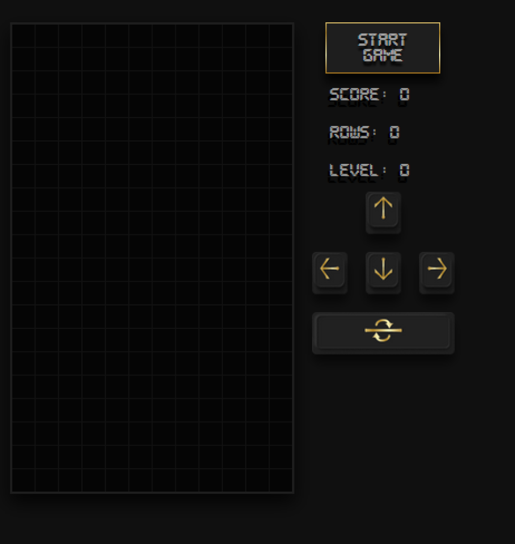

# Tetris - With React

I used react for this project for the pure purpose of practicing React.

[Checkout a hosted version here](https://syntheticdesigner.github.io/tetris-react/)

## Table of contents

- [Overview](#overview)
  - [The challenge](#the-challenge)
  - [Screenshot](#screenshot)
  - [Links](#links)
- [My process](#my-process)
  - [Built with](#built-with)
  - [What I learned](#what-i-learned)
  - [Useful resources](#useful-resources)
- [Author](#author)

## Overview

### The challenge

Users should be able to:

- [x] View the optimal layout for the site depending on their device's screen size
- [x] Use keyboard keys to control the tetris board.
- [x] View the their current score, number of rows cleared and current level of difficulty.

Stretch Goals:

- [x] Create touch friendly buttons for mobile use.

Future Development:

- Create a pause button.
- Create an info button that displays rules.

### Screenshot

### Links

- Solution URL: [https://github.com/SyntheticDesigner/tetris-react](https://github.com/SyntheticDesigner/tetris-react)
- Live Site URL: [https://syntheticdesigner.github.io/tetris-react/](https://syntheticdesigner.github.io/tetris-react/)

## My process

### Built with

- Semantic HTML5 markup
- CSS custom properties
- CSS Grid
- [React](https://reactjs.org/) - JS library
- [Styled Components](https://styled-components.com/)
- [React Interval](https://www.npmjs.com/package/react-interval)

### What I learned

Creating custom hooks make performing complex operations recursively much cleaner, a little extra set up goes a long way.

Handling both clicks and touch at the same time requires managing every aspect of each event and ensuring that events are not firing multiple times.
> Click events are not the same as key presses and do not act the same what so ever.

### Useful resources

- [How to Build Tetris in React - GameDev Tutorial (with React Hooks!)](https://www.youtube.com/watch?v=ZGOaCxX8HIU)

I want to thank freeCodeCamp for this awesome walkthrough. I will be building on this app more in future to experiment with user input and interval.

## Author

- Website - [Andrew Schroepfer](https://syntheticdesigner.github.io/)
- Social - [Linkedin](https://www.linkedin.com/in/andrew-schroepfer/)
